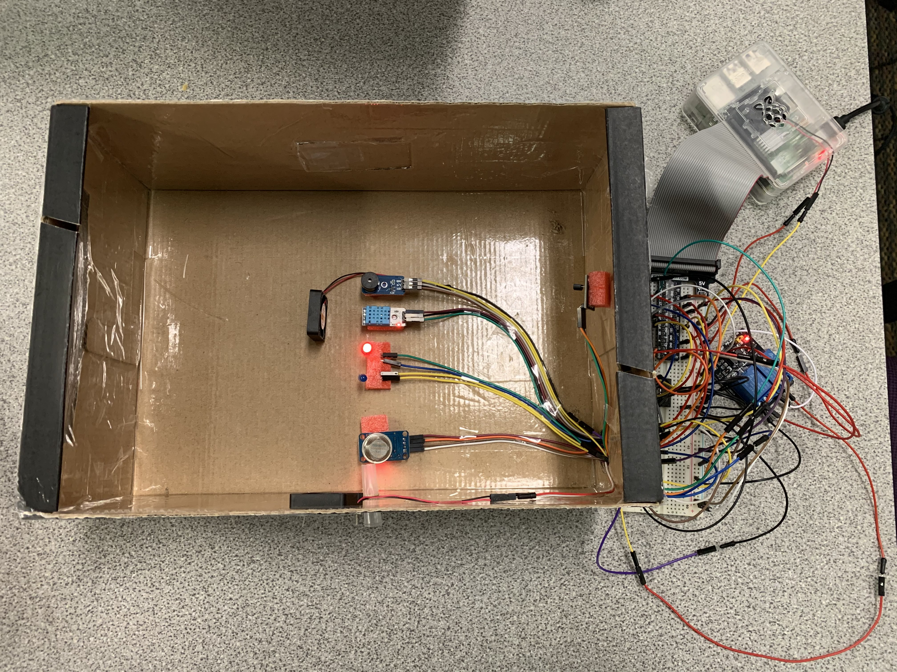
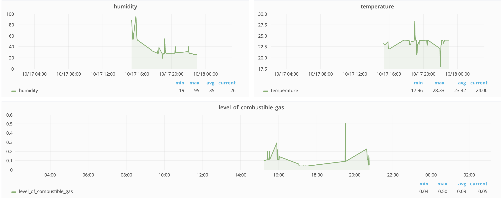

 <body>

  

  <nav class="site-nav">
    <a href="#" class="menu-icon">
      <i class="fa fa-navicon fa-lg"></i>
    </a>
  </nav>

  

  

    

      

  <header class="post-header">
     <h1 class="post-title" style="text-align: center">Indoor Air Quality Monitoring System</h1>
  </header>

<h2 id="introduction">Introduction</h2>
<ul>
  This project is designed to simulate an integrated indoor air quality real-time monitoring system prototype. The system will utilize a multi sensor system that placed at different locations within a closed environment and measure relevant quantities such that could provide insights to the environment air conditions. The project also enabled the IOT features such that it allows users to manipulate and visualize smart devices status using web-based platform.
</ul>

<h2 id="Review of Sensors Being Utilized"> Review of Sensors Being Utilized </h2>
  The sensors that are used for Indoor Air Quality Monitoring System are as follows:
<ul style="list-style-type:circle;">
  <li>DHT11</li>
  <li>MQ-2</li>
  <li>DS18B20 (Reference)</li>
</ul>
  The indication devices includes:
<ul style="list-style-type:circle;">
  <li> Leds in different colors(blue and red) </li>
  <li>Buzzer Module</li>
</ul>
Physical devices integrated:
<ul style="list-style-type:circle;">
  <li> Ventilation fan</li>
  <li> Heat dissipation fan</li>
</ul>

<h2 id="Experiment">Experiment and Results</h2>
<h3 id="Two Modes">The “Two Mode”</h3>
<ul>

The experiment is designed from two perspectives: the “IOT Mode” and the “Automatic Mode”.

  In the IOT Mode, the devices can establish remote communication with a web-based system architecture, OpenChirp, through communication protocol (MQTT, LP-WAN [2]) when presenting qualified authentication key. Users will, then, have the accessibility and flexibility to control the devices through either apps or web browser. The devices can be further controlled and visualized in various formats (i.e. time-series) by accessing this management  framework and the data were being stored at remote database at the same time.

  In the “Automatic Mode”, the sensing system will run locally and automatically, which can be accessed by other devices through local network protocol. Under this mode, no specific inputs are expected from users. The indication devices and physical devices within the system will be powered depends on the real-time sensing data and decision functions. The design of the decision functions take several factors into consideration including seasonality, comfort level, etc.

</ul>
<h3 id="problems-encountered">Experiment Expectations</h3>

<figure>
    

    
    <figcaption> <strong>Figure 1:</strong> Experiment Setup </figcaption>
    

</figure>

<ul>
 

The key expectation when user performing under IOT mode will be the ability to turn on/off the indications devices(led, fan, and buzzer) by remotely sending commands to the OpenChirp server and the ability to visualize real time series sensor data through OpenChirp web platform.

On the other hand, the expectation of the system when performing under Automatic Mode will again based on various factors like those mentioned above. Generally, all devices remain static under comfort conditions and will start to take actions when sensing data is out of desired comfortable range. The specific action taken by the device is based on device type, for example the indicators will be turned on to serve as warning and fan will be turned on to dissipate the heat/smoke. More specifically, the red led is expected to be turned on when the indoor temperature exceeds the comfort temperature upperbond, and the fan will be turned on simountiously for the purpose of heat dissipation. Similarly, the blue led is expected to be turned on when the temperature is below the comfort temperature lower bond. The buzzer alarm will produce noise when gas level is above the safety threshold, and the ventilation fan will also simultaneously be turned on to help expeling unsafe gas.

</ul>
<h3 id="problems-encountered">Experiment Process and Conditions</h3>
<ul>
The experiment is started by asking user for input choices to determine which mode the system should run. If the IOT mode was chosen, the experiment would perform primarily based on OpenChirp web platform. The specific details include sending commands remotely to turn on/off the devices then observing whether the physical system produce desired results.
On the other hand, if the Automatic mode was chosen, the experiment is performed through several steps:
</ul>
<ol>
    <li>Rising temperatures and observing corresponding indicator and fan responses.</li>
    <li>Hold to see the effect of heat dissipation by using the fan (measured by seconds)</li>
    <li>Rising smoke density and observe buzzer and ventilation fan reponses.</li>
    <li>Hold to see the effect of the expelation of the dangerous gas by ventilation fan. (seconds)</li>
    <li>Periodically run sensor performance measurement</li>
</ol>
<h3 id="problems-encountered">Monitoring Sensor Performance</h3>
<ul>
  

    For the purpose of quantifying the temperature sensor(DHT11) performance, the project also implemented a second reference temperature sensor DS18B20, which discussed in previous section in detail.
  

  

    The performance measurements are based on descriptive statistical error analysis which treats the reference sensor data as ground truth and compare the temperature sensor data from DHT11 with the ground truth. The target is binary outcome that decide if the temperature sensor data have same result versus ground truth in determining whether the temperature is within the comfortable range mentioned in the previous section. The performance metrics is represented in terms of confusion metrics and further derived precision and recall scores.
  

</ul>

<h3 id="problems-encountered">Result</h3>
<ul>
<figure>
    

    
    <figcaption> <strong>Figure 6:</strong> OpenChirp IOT real time sensor data monitoring</figcaption>
    

</figure>

Under IOT mode, users can have a real time monitoring sensor data as shown in the figure 3.

  Under the automatic mode, the heat dissipation with fan uses 6s to cool down temperature and 15s without fan to cool down using room temperature. So there is a 60% effectiveness improvement when using the fan to reduce the temperature. Similarly, there is a 43% of  improvement to expel unsafe gas using the ventilation fan. Both precision and recall are mostly 100% to show the health condition of the temperature sensor.
  Both precision and recall are presented in the openChirp to present a visulization of the sensor performance. If the sensor,DHT11, failed to recognize most of the cases, the reference sensor would replace the DHT11 to continue performing sensing.

</ul>

<h2 id="problems-encountered">Reference</h2>

 [1] ASHRAE, Thermal Environmental Conditions for Human Occupancy, American Society of Heating, Refrigerating and Air-Conditioning Engineers (ASRHAE Standard 55-1992), Atlanta, 1992.

 [2] Technical Staff of General Monitors, Fundamentals of Combustible Gas Detection.

 [3] Dejan. “DHT11 & DHT22 Sensors Temperature and Humidity Tutorial using Arduino”, March, 2016, <a href="https://howtomechatronics.com/tutorials/arduino/dht11-dht22-sensors-temperature-and-humidity-tutorial-using-arduino/.">https://howtomechatronics.com/tutorials/arduino/dht11-dht22-sensors-temperature-and-humidity-tutorial-using-arduino/.</a>

 [4] Last Minute ENGINEERS, “How DHT11 DHT22 Sensors Work & Interface With Arduino” <a href="https://lastminuteengineers.com/dht11-dht22-arduino-tutorial/.">https://lastminuteengineers.com/dht11-dht22-arduino-tutorial/.</a>

 [5] Last Minute ENGINEERS, “Interfacing DS18B20 1-Wire Digital Temperature Sensor with Arduino”, <a href="https://lastminuteengineers.com/ds18b20-arduino-tutorial/.">https://lastminuteengineers.com/ds18b20-arduino-tutorial/.</a>

 [6] Hanwei Electronics CO.,LTD, Technical Data MQ-2 Gas Sensor.<a href="https://lastminuteengineers.com/ds18b20-arduino-tutorial/.">https://lastminuteengineers.com/ds18b20-arduino-tutorial/.</a>

 [7] MQ-2 Semiconductor Sensor for Combustible Gas<a href="https://www.pololu.com/file/0J309/MQ2.pdf"> https://www.pololu.com/file/0J309/MQ2.pdf</a>

  

  	<a href="#">
  	<i class="fa fa-arrow-circle-up fa-2x"></i>
  	</a>
  

  

